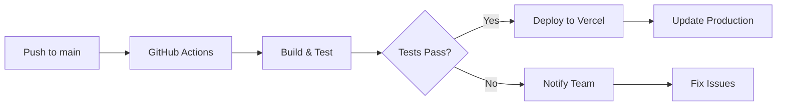

# 🏪 Loja Castor Cabo Frio - Website E-commerce

## 📋 Índice
- [Sobre o Projeto](#-sobre-o-projeto)
- [🚀 Execução e Desenvolvimento](#-execução-e-desenvolvimento)
- [🧪 Testes](#-testes)
- [🚢 Deploy](#-deploy)
- [✏️ Edição e Atualização](#️-edição-e-atualização)
- [📞 Contatos](#-contatos)
- [🏪 Dados da Loja](#-dados-da-loja)
- [🔗 Links Oficiais](#-links-oficiais)
- [👨‍💻 Onboarding para Desenvolvedores](#-onboarding-para-desenvolvedores)
- [📦 Manutenção de Produtos](#-manutenção-de-produtos)
- [🤖 Bot de Atendimento](#-bot-de-atendimento)
- [🧮 Calculadora de Biotipo](#-calculadora-de-biotipo)
- [🔄 Fluxo de Deploy](#-fluxo-de-deploy)
- [🌐 Variáveis de Ambiente](#-variáveis-de-ambiente)

## 🎯 Sobre o Projeto

Website e-commerce da **Loja Castor Cabo Frio**, desenvolvido com Next.js 14, TypeScript e Tailwind CSS. O projeto inclui catálogo de produtos, calculadora de biotipo, bot de atendimento e integração completa com WhatsApp.

### 🛠️ Tecnologias Utilizadas
- **Frontend**: Next.js 14 (App Router), React 18, TypeScript
- **Styling**: Tailwind CSS
- **Deploy**: Vercel
- **Analytics**: Google Analytics, Search Console
- **Comunicação**: WhatsApp API, Weni
- **CI/CD**: GitHub Actions
- **Monitoramento**: Pingdom, UptimeRobot

## 🚀 Execução e Desenvolvimento

### Pré-requisitos
- Node.js 18+ 
- npm ou yarn
- Git

### Instalação
```bash
# Clone o repositório
git clone https://github.com/Taranto1987/horizon-website.git
cd horizon-website

# Instale as dependências
npm install

# Configure as variáveis de ambiente
cp .env.example .env.local
# Edite .env.local com suas configurações
```

### Scripts Disponíveis

#### Desenvolvimento
```bash
# Inicia o servidor de desenvolvimento
npm run dev

# Servidor estará disponível em http://localhost:3000
```

#### Build e Produção
```bash
# Build para produção
npm run build

# Inicia servidor de produção local
npm run start

# Verificação de tipos TypeScript
npm run type-check
```

#### Linting e Qualidade
```bash
# Executa ESLint
npm run lint

# Corrige problemas automaticamente
npm run lint:fix
```

## 🧪 Testes

### Executar Testes
```bash
# Executa todos os testes
npm run test

# Testes em modo watch
npm run test:watch

# Cobertura de testes
npm run test:coverage
```

### Performance e SEO
```bash
# Análise Lighthouse automatizada
npm run lighthouse
```

## 🚢 Deploy

### Deploy Automático (Vercel)
- **Branch Principal**: Deploy automático em `main`
- **Preview Deploys**: Todos os PRs geram preview
- **Rollback**: Automático em caso de falha

```bash
# Deploy manual para produção
npm run deploy

# Deploy preview
npm run deploy:preview
```

### Configuração Vercel
1. Conecte o repositório no [Vercel Dashboard](https://vercel.com/dashboard)
2. Configure domínio: `www.lojacastorcabofrio.com.br`
3. Defina variáveis de ambiente no painel Vercel
4. SSL é configurado automaticamente

## ✏️ Edição e Atualização

### Atualização de Produtos
```bash
# Exportar produtos atuais
npm run export:products

# Importar novos produtos
npm run import:products
```

### Backup e Restauração
```bash
# Criar backup completo
npm run backup

# Restaurar backup
npm run restore
```

### Edição de Conteúdo
- **Produtos**: Edite `src/components/BiotipoCalculator/calculatorData.ts`
- **Cores da marca**: Modifique `tailwind.config.js`
- **Informações da loja**: Atualize `src/app/layout.tsx` e `src/app/page.tsx`

## 📞 Contatos

### Contatos Técnicos
- **Desenvolvedor Principal**: [Adicionar contato]
- **Suporte GitHub**: Issues do repositório
- **Email Técnico**: [Adicionar email]

### Contatos da Loja
- **WhatsApp**: (22) 99999-9999
- **Email**: [Adicionar email da loja]
- **Endereço**: Cabo Frio - RJ

## 🏪 Dados da Loja

### Informações Básicas
- **Nome**: Loja Castor Cabo Frio
- **Localização**: Cabo Frio - RJ
- **Especialidade**: Produtos de qualidade
- **Tradição**: Anos servindo a região

### Horário de Funcionamento
- **Segunda a Sexta**: 8h às 18h
- **Sábado**: 8h às 14h
- **Domingo**: Fechado

## 🔗 Links Oficiais

### Website
- **Produção**: https://www.lojacastorcabofrio.com.br
- **Staging**: [URL de staging se houver]

### Redes Sociais
- **WhatsApp**: wa.me/5522999999999
- **Instagram**: [Adicionar se houver]
- **Facebook**: [Adicionar se houver]

### Ferramentas
- **Vercel Dashboard**: [Link do projeto]
- **Google Analytics**: [Link da propriedade]
- **Search Console**: [Link da propriedade]

## 👨‍💻 Onboarding para Desenvolvedores

### Primeiro Acesso
1. **Clone e Setup**
   ```bash
   git clone https://github.com/Taranto1987/horizon-website.git
   cd horizon-website
   npm install
   cp .env.example .env.local
   ```

2. **Configuração do Ambiente**
   - Configure variáveis em `.env.local`
   - Teste o ambiente: `npm run dev`
   - Execute os testes: `npm run test`

3. **Estrutura do Projeto**
   ```
   src/
   ├── app/           # App Router (Next.js 14)
   ├── components/    # Componentes React
   ├── lib/          # Utilitários e configurações
   ├── types/        # Tipos TypeScript
   └── utils/        # Funções auxiliares
   ```

### Fluxo de Contribuição
1. Crie uma branch: `git checkout -b feature/nova-funcionalidade`
2. Desenvolva e teste localmente
3. Execute linting: `npm run lint`
4. Commit com mensagem clara
5. Abra Pull Request
6. Aguarde review e merge

### Padrões de Código
- **TypeScript**: Tipagem obrigatória
- **ESLint**: Seguir configuração do projeto
- **Commits**: Mensagens em português, claras e objetivas
- **Components**: Sempre criar em TypeScript (.tsx)

## 📦 Manutenção de Produtos

### Estrutura de Produtos
```typescript
interface Product {
  name: string;
  price: string;
  description?: string;
  category?: string;
}
```

### Adicionando Produtos
1. Edite `src/components/BiotipoCalculator/calculatorData.ts`
2. Adicione o produto no array `castorProducts`
3. Teste localmente
4. Commit e deploy

### Categorias Disponíveis
- `premium`: Produtos premium
- `tradicional`: Linha tradicional
- `economico`: Linha econômica
- `kit`: Kits e combos

### Gerenciamento de Imagens
```bash
# Organizar imagens em public/images/
public/
└── images/
    ├── produtos/
    ├── banners/
    └── logos/
```

## 🤖 Bot de Atendimento

### Funcionalidades
- Chat flutuante no canto da tela
- Respostas automáticas básicas
- Redirecionamento para WhatsApp
- Histórico de conversas na sessão

### Personalizando Respostas
Edite `src/components/SalesBot.tsx`:
```typescript
// Adicione novas palavras-chave e respostas
if (inputMessage.toLowerCase().includes('palavra-chave')) {
  botResponse = 'Sua resposta personalizada'
}
```

### Métricas
- Interações são trackeadas via Google Analytics
- Conversões para WhatsApp são monitoradas

## 🧮 Calculadora de Biotipo

### Como Funciona
1. Usuário responde 3 perguntas
2. Sistema calcula pontuação
3. Determina biotipo (Ectomorfo/Mesomorfo/Endomorfo)
4. Permite compartilhar resultado

### Personalizando Perguntas
Edite `src/components/BiotipoCalculator/calculatorData.ts`:
```typescript
export const biotipoQuestions: BiotipoQuestion[] = [
  {
    id: "nova_pergunta",
    question: "Sua pergunta aqui?",
    options: [
      { value: "opcao1", label: "Opção 1", points: 1 },
      // ... mais opções
    ]
  }
]
```

### Algoritmo de Cálculo
- **Ectomorfo**: 3-4 pontos
- **Mesomorfo**: 5-7 pontos  
- **Endomorfo**: 8-9 pontos

## 🔄 Fluxo de Deploy

### Deploy Automático


### Verificações Pré-Deploy
- ✅ Testes unitários passando
- ✅ Build sem erros
- ✅ Linting aprovado
- ✅ TypeScript sem erros

### Rollback Automático
- Falha detectada em 2 minutos
- Rollback automático para versão anterior
- Notificação via webhook/email

### Monitoramento Pós-Deploy
- Uptime check (UptimeRobot/Pingdom)
- Performance monitoring
- Error tracking

## 🌐 Variáveis de Ambiente

### Obrigatórias
```bash
# Site
NEXT_PUBLIC_SITE_URL=https://www.lojacastorcabofrio.com.br
NEXT_PUBLIC_SITE_NAME="Loja Castor Cabo Frio"

# Analytics
NEXT_PUBLIC_GA_ID=G-XXXXXXXXXX
```

### Opcionais
```bash
# WhatsApp
WHATSAPP_TOKEN=seu-token-aqui
WHATSAPP_PHONE_NUMBER=+5522999999999

# Monitoring
UPTIME_ROBOT_API_KEY=sua-chave-aqui
```

### Configuração no Vercel
1. Acesse [Vercel Dashboard](https://vercel.com/dashboard)
2. Selecione o projeto
3. Vá em Settings > Environment Variables
4. Adicione cada variável conforme ambiente

### Segurança
- ❌ **NUNCA** commite `.env.local`
- ✅ Use `NEXT_PUBLIC_` apenas para variáveis públicas
- ✅ Mantenha secrets no painel da Vercel
- ✅ Documente todas as variáveis necessárias

---

## 🚨 Checklist Pós-Deploy

### Testes Funcionais
- [ ] Homepage carrega corretamente
- [ ] Produtos são exibidos
- [ ] Bot de atendimento funciona
- [ ] Calculadora de biotipo funciona
- [ ] Links do WhatsApp funcionam

### Performance (Lighthouse)
- [ ] Performance Score > 90
- [ ] Accessibility Score > 95
- [ ] Best Practices Score > 95
- [ ] SEO Score > 95

### SEO
- [ ] Meta tags configuradas
- [ ] Sitemap.xml acessível
- [ ] Robots.txt configurado
- [ ] Schema.org implementado

### Integrações
- [ ] Google Analytics tracking
- [ ] Search Console verificado
- [ ] WhatsApp links funcionais
- [ ] Uptime monitoring ativo

### SSL e Domínio
- [ ] HTTPS funcionando
- [ ] Certificado SSL válido
- [ ] Redirecionamento HTTP → HTTPS
- [ ] Domínio principal funcionando

---

## 🆘 Suporte e Troubleshooting

### Problemas Comuns

#### Build Falha
```bash
# Limpar cache
rm -rf .next node_modules
npm install
npm run build
```

#### Erro de Tipo TypeScript
```bash
# Verificar tipos
npm run type-check
```

#### Deploy não Funciona
1. Verificar variáveis de ambiente no Vercel
2. Checar logs de build no dashboard
3. Verificar se todas as dependências estão corretas

### Contatos de Emergência
- **Vercel Support**: [Link de suporte]
- **GitHub Issues**: [Link do repositório]
- **Desenvolvedor Principal**: [Contato]

---

**Última atualização**: Dezembro 2024  
**Versão**: 1.0.0  
**Mantenedor**: Loja Castor Cabo Frio